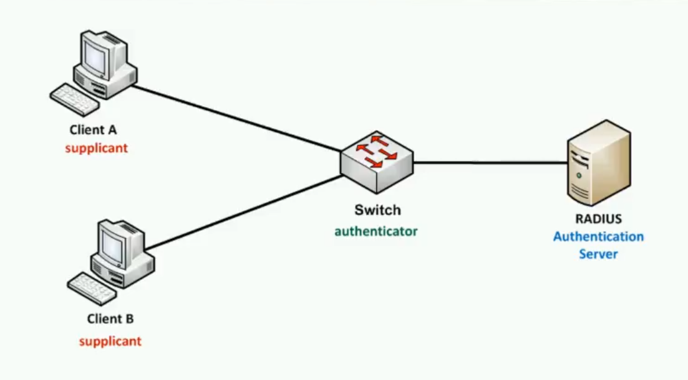
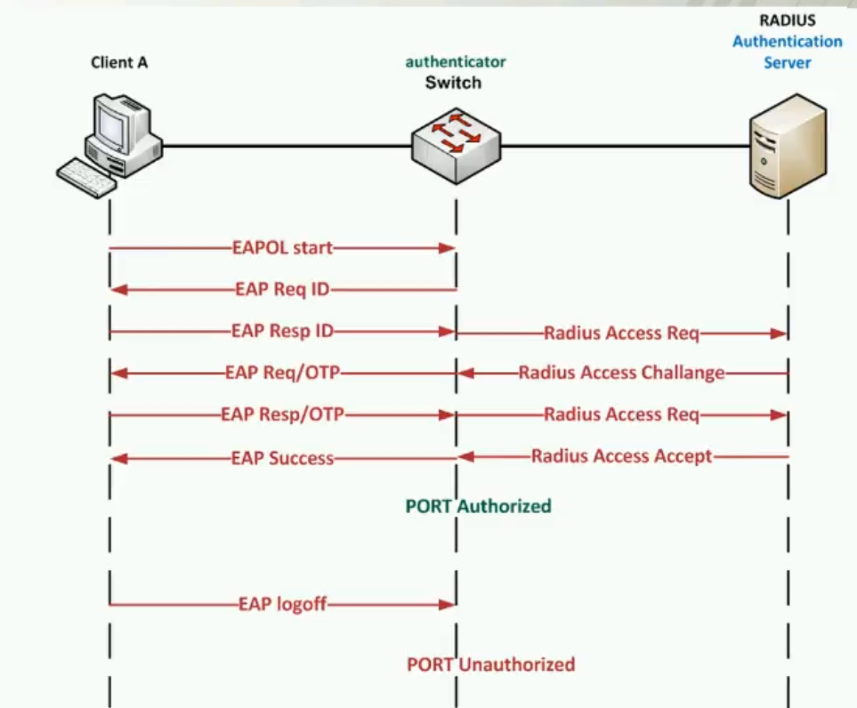
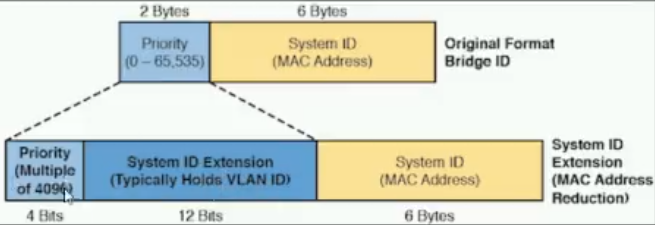
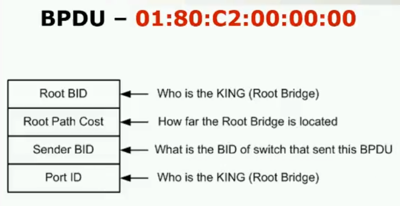
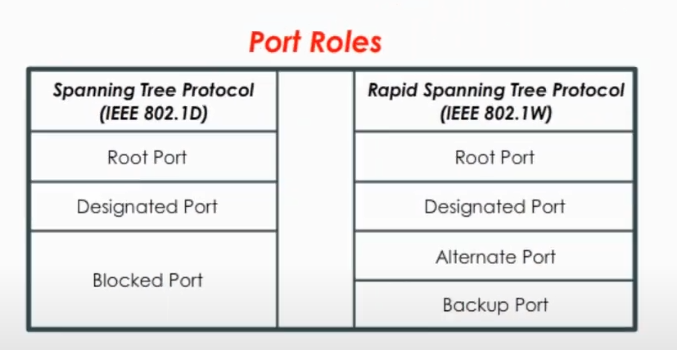
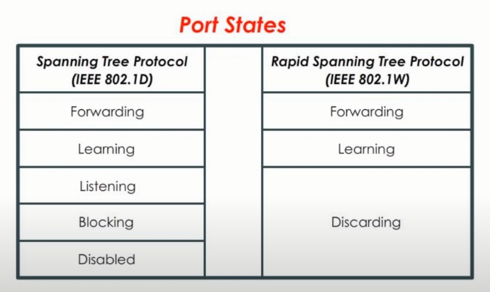
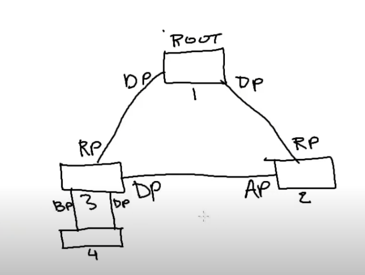

# Standard 802.1x

## Cechy charakterystyczne:

- Serwer działa na zasadzie klient-serwer

- Występuje:

    - acces control - kontrola dostępu
    - authentication protocol - uwierzytelnienie

- Standard ten umożliwia:

    - EAPoL ( Extensible Authentication Protocol over Lan )
    - CDP ( Cisco Discovery Protocol )
    - STP ( Spanning Tree Protocol )

---

## EAP

- **warstwa druga**
- protokół ten eliminujue dublowanie się ramek
- możliwość retransmisji
- tylko switch może enkapsulować dane
- verdykt -> ***Access-Accept*** lub ***Access-Reject***

---

## Radius server

- **Remote Authentication Dial In User Service**
- uwierzytelnia, autoryzuje
- wspiera EAP
- korzysta z UDP - czyli **warstwa 3**
- podaje konkretne wiadomości:
    - odnoście dostępu
    - numer sekwencyjny 
    - długość
    - pole uwierzytelniania

---
## Jak działa sieć?

- Klient - rząda dostępu, na urządzeniu musi być odpowiedni software (dla IEEE 802.1x)

- Authenticator (przełącznik lub acces point):

    - monitoruje fizyczny dostęp do sieci
    - działa jak proxy
    - encapsulacja ramek EAP - interakcja z serwerem uwierzytelniającym  
    - kiedy switch otrzymuje ramkę EAPoL:

        1. ucina nagłowek ethernetu
        2. pozostałą ramkę na nowo enkapsuluje do formatu *RADIUS*
        3. przekazuje je do serwera (musi on wspierać EAP)

    - kiedy otrzymuje ramkę od serwera:

        1. nagłówek zostaje usunięty -> zostaje ramka EAP 
        2. ramka ta zostaje enkapsulowana do ramki Ethernetowej i wysłana do klienta

- Serwer:
    - decyduje o tym, czy do sieci może zostać podłączony klient
    - to on uwierzytelnia klienta i informuje o tym switcha

---
## Proces uwierzytelniania
- ***Success*** - przydzielono dostęp
- ***Invalid identity*** - wtedy klient może być przydzielony do pewnego ograniczonego VLANu
- ***Lack of Radius*** - brak serwera uwierzytelniającego
- ***Authentication timeout*** - za długi czas czekania na EAPoL

---
## Statusy portów
(nazewnictwo un/autohorized <--> nie/autoryzowany)
- Autoryzowany -> normalny ruch
- Nieautoryzowany -> pozostaje tylko
    - IEEE 802.1x authentication
    - CDP
    - STP
- Jeżeli klient nie wspiera 802.1x to porty są dalej w trybie nieautoryzowanym
- Jeżeli serwer nie wspiera 802.1x to ostatecznie przesyłane ramki są w taki sposób, jakby porty były w trybie autoryzowanym
- zamykanie sieci -> link-down jako powrót portu do truby unauthorized
- Logoff -> serwer wysyła żądanie EAPoL-logoff msg i port przechodzi w tryb unathorized

---

## Inne tryby
- Host mode - *single host* ( jeden klient ) / *multiple Host* ( wiele klientów )
- accounting ( activity monitoring ) - monitorowanie portów
- VLAN assignment - po poprawnym uwierzytelnianiu poprze RADIUS klient jest przydzielony do odpowiedniego vlanu 
- Auth-guest VLAN - przydzielenie do VLANU "dla gości" - po nieudanym uwierzytelnieniu lub timeout-cie
- Auth-restricted VLAN - ograniczone usługi vlanu
- Auth-Inaccessible Authentication Bypass - brak łączności z RADIUS 
- Auth-MAC Auth Bypass - adres MAC może być wpuszczony do sieci dzięki wcześniej zdefiniowanych adresów

---

# STP oraz RSTP

## Spanning Tree Protocol ( STP )
Zapobieganie pętlom - burzy rozgłoszeniowej w warstwie 2.

- Składa się z:

    1. BID - Bridge Identifer - składa się z priorytetu oraz adresu MAC

        

    2. Port Identifier (PID) - składa się z priorytetu oraz numeru portu

    3. Path Cost - zależność od szybkości łącza

    4. BPDU - Bridge Protocol Data Unit

        

- Trzy pierwsze inicjalizujące kroki:

    1. Wybranie roota

    2. Wybranie **root ports** - czyli którymi portami będzie nam najbliżej dotrzeć do roota

    3. Wybranie **designated ports** - czyli porty **designated switcha**, który ma najlepszą drogą do roota

    ( poza wyżej wymienionymi portami są jeszcze **blocked ports**, które uniemożliwiają tworzenie się pętli)

- cztery kroki decyzyjności STP:

    1. najmniejsze BID
    2. najmniejszy koszt ścieżki do roota
    3. najmniejszy otrzymany/wysłany BID
    4. najmniejszy otrzymany/wysłany PID

## RSTP ( Rapid spanning-tree protocol)

- W tym protokole powiększono porty o stany **alternate** oraz **backup**:

    1. **alternate** - druga najlepsza ścieżka do roota -> porty alternatywne przejmują rolę root portów

    2. **backup** - nie przekazuje ramek dalej -> przejmuję rolę portów dezygnowanych

    
    

- poniżej zaprezentowano jak działają role portów w sieci z protokołem RSTP:

    

- **edge ports** - porty te przechodzą od razu w stan *forwarding* - po otrzymaniu ramki BPDU przechodzą w zwykły tryb ( tak jak w STP )

- **link type**:

    - point-to-point - działa w full-duplex ( wysyłanie i odbieranie naraz )

    - shared - half-duplex ( wysyła i odbiera, ale niejednocześnie )

- ulepszenia w 802.1w:

    - **uplink fast** - główne działanie to przyspieszenie przejścia do trybu forwardingu ( z portu blokowanego )

    - **backbone fast** - redukuje max-age time, czyli po przerwaniu połączenia następuje szybsze "naprawienie" sieci

## MSTP ( Multiple spanning-tree protocol )

Każdy vlan może mieć swoją hierarchię STP

- dodatkowo PVSTP (Per Vlan Spanning-tree Protocol) - każdy vlan ma swoją hierarchię STP

- umożliwia łączenie różnych hierarchi vlanów - w jednych zakresach port może być blocked, w innych forwarding

- zamiast tworzenia nowych STP dla kolejnych vlanów możemy je łączyć regiony
- aby połączyć hierarchie muszą być spełnione warunki:

    - ta sama nazwa
    - ta sama instacja
    - ten sam revision number